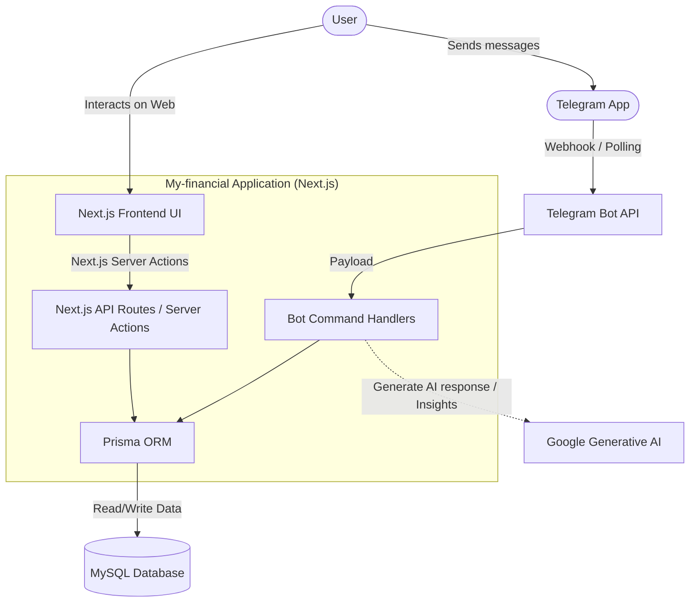

# My-financial 💰

A full-stack financial tracking application built with Next.js, Prisma, and Tailwind CSS. The system integrates a Telegram Bot for seamless financial data entry, an AI-powered assistant using Google Generative AI, and a modern dashboard to visualize and manage all your transactions.

## 🚀 Features

- **Financial Dashboard**: A sleek, dark-themed UI to monitor and analyze personal finances and track transactions.
- **Telegram Bot Integration**: Track expenses and manage financial data directly through a Telegram Bot. Supports quick data entry, report generation, and account reset commands.
- **AI-Powered Insights**: Uses Google Generative AI to provide smart recommendations and suggestions based on financial data.
- **Authentication System**: Secure user authentication handled internally using `bcrypt` (password hashing) and `jose` (JWT).
- **Database Management**: Robust database schema powered by Prisma ORM.
- **Docker Support**: Containerized environment for easy development and consistent production deployment.

## 🛠️ Tech Stack

- **Framework**: [Next.js](https://nextjs.org/) (App Router, React 19)
- **Styling**: [Tailwind CSS v4](https://tailwindcss.com/)
- **Database ORM**: [Prisma](https://www.prisma.io/)
- **Authentication**: `bcrypt`, `jose`
- **AI Integration**: `@google/generative-ai`
- **Containerization**: Docker & Docker Compose

## 🏗️ System Architecture



### Component Breakdown

1. **Frontend (Next.js App Router)**: Built with **React 19** and **Tailwind CSS v4**, this is the web-based dashboard where users log in (secured via `bcrypt` and `jose` JWTs) and view their financial statistics, transaction history, and manage budgets/categories.
2. **Backend (Next.js Server / API / Server Actions)**: Handles web interface interactions and acts as the secure middle layer between the frontend and the database.
3. **Telegram Bot Engine**: Processes messages sent by the user, handling commands like `/tambah` (add), `/laporan` (report), and `/reset`. Depending on the environment, it uses a webhook implementation (Vercel) or a webhook/polling fallback (`polling-bot.js`).
4. **Database Access (Prisma ORM)**: A type-safe interface for managing data stored in a **MySQL** database.
5. **AI Integration (Google Generative AI)**: Connects to the Gemini API (`@google/generative-ai`) to offer smart insights or responses.

## 📦 Installation & Local Setup

### 1. Clone the repository

```bash
git clone https://github.com/your-username/my-financial.git
cd my-financial
```

### 2. Install dependencies

```bash
npm install
```

### 3. Environment Variables

Create a `.env` file in the root directory and configure the necessary variables (refer to local setup needs):

```env
# Database connection string
DATABASE_URL="your-database-url"

# Telegram Bot Token (from BotFather)
TELEGRAM_BOT_TOKEN="your-bot-token"

# JWT Secret for Auth
JWT_SECRET="your-jwt-secret"

# Google Generative AI API Key
GEMINI_API_KEY="your-gemini-api-key"
```

### 4. Database Setup

Run the Prisma migrations to initialize the database schema:

```bash
npx prisma migrate dev
```

### 5. Run the Application Local Server

```bash
npm run dev
```

The application will be available at [http://localhost:3000](http://localhost:3000).

## 🤖 Telegram Bot Configuration

The project includes custom scripts to manage the Telegram Bot hooks and local polling:

- **Run bot via polling (Development)**:
  ```bash
  node polling-bot.js
  ```
- **Set Bot Webhook (Production)**:
  Configure your webhook to point to the production Vercel domain.
  ```bash
  node set-webhook.js
  ```

## 🐳 Docker Deployment

The project provides both development and production Docker Compose files.

### Development Environment
```bash
docker-compose -f docker-compose.dev.yml up -d
```

### Production Environment
```bash
docker-compose up -d --build
```

## 📝 License

This project is licensed under the MIT License.
